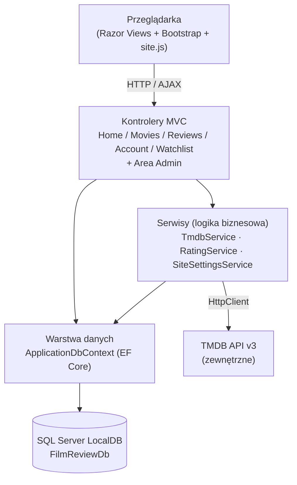
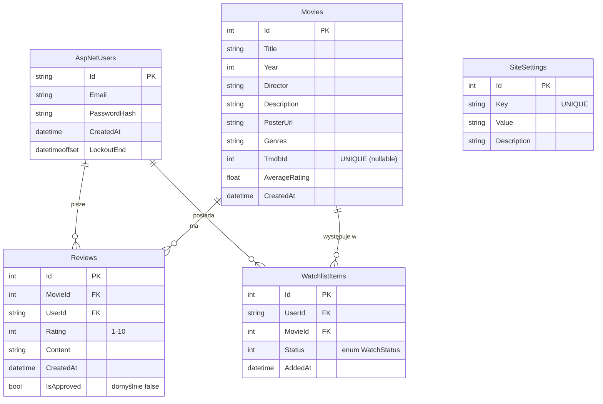
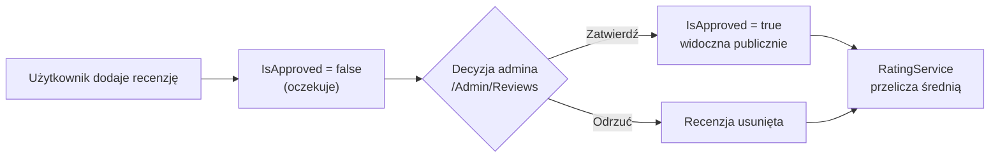
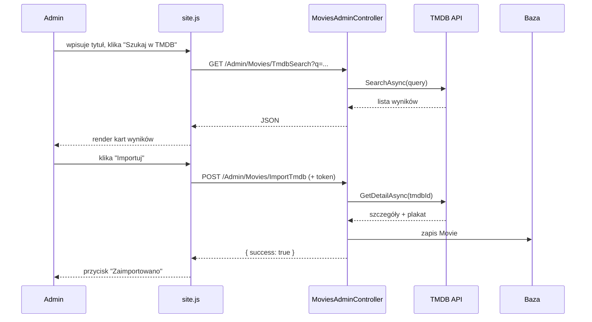

# Dokumentacja techniczna — Film Review App

Dokument opisuje architekturę rozwiązania, strukturę bazy danych oraz najważniejsze
zaimplementowane funkcjonalności aplikacji **Film Review App**.
Instrukcja uruchomienia i dane logowania znajdują się w [README.md](README.md).

Spis treści:
1. [Przegląd](#1-przegląd)
2. [Stos technologiczny](#2-stos-technologiczny)
3. [Architektura rozwiązania](#3-architektura-rozwiązania)
4. [Struktura projektu](#4-struktura-projektu)
5. [Struktura bazy danych](#5-struktura-bazy-danych)
6. [Najważniejsze funkcjonalności](#6-najważniejsze-funkcjonalności)
7. [Bezpieczeństwo](#7-bezpieczeństwo)
8. [Warstwa frontendu i RWD](#8-warstwa-frontendu-i-rwd)
9. [Dane startowe (seed)](#9-dane-startowe-seed)

---

## 1. Przegląd

Film Review App to serwis filmowy zbudowany w architekturze **ASP.NET Core 8 MVC**.
Pozwala niezalogowanym użytkownikom przeglądać katalog filmów, zalogowanym — recenzować
filmy i prowadzić watchlistę, a administratorom — zarządzać treścią, moderować recenzje
oraz importować filmy z zewnętrznego serwisu **TMDB**.

Aplikacja realizuje trzy poziomy dostępu:

| Rola | Uprawnienia |
|------|-------------|
| Gość (niezalogowany) | przeglądanie katalogu, szczegółów filmów i recenzji, rejestracja/logowanie |
| Użytkownik (`User`) | dodawanie/edycja/usuwanie własnych recenzji, watchlista, profil |
| Administrator (`Admin`) | pełny panel `/Admin`: CRUD filmów, import TMDB, moderacja recenzji, zarządzanie użytkownikami, CMS |

---

## 2. Stos technologiczny

| Warstwa | Technologia |
|---|---|
| Backend | ASP.NET Core 8 MVC (C#) |
| ORM / baza danych | Entity Framework Core 8 (code-first) + SQL Server LocalDB |
| Uwierzytelnianie i autoryzacja | ASP.NET Core Identity (role `User`, `Admin`) |
| Frontend | Bootstrap 5 + Font Awesome 6 (CDN) |
| Interaktywność | Vanilla JavaScript (Fetch API, AJAX) |
| Integracja zewnętrzna | TMDB API v3 |

---

## 3. Architektura rozwiązania

Aplikacja jest zbudowana zgodnie ze wzorcem **MVC** z wyraźnym podziałem na warstwy
oraz **wstrzykiwaniem zależności (DI)**. Logika biznesowa jest wydzielona z kontrolerów
do osobnych serwisów (kontrolery pozostają „cienkie”).

### 3.1. Warstwy



### 3.2. Komponenty i ich odpowiedzialność

| Komponent | Odpowiedzialność |
|---|---|
| **Modele** (`Models/`) | encje bazodanowe mapowane przez EF Core |
| **ViewModele** (`Models/ViewModels/`) | obiekty transferowe dla widoków — oddzielają warstwę prezentacji od encji, ograniczają *over-posting* i upraszczają walidację |
| **ApplicationDbContext** (`Data/`) | konfiguracja modelu, relacji i indeksów; dziedziczy po `IdentityDbContext<ApplicationUser>` |
| **TmdbService** | typowany `HttpClient`; metody `SearchAsync`, `GetDetailAsync`, `MapToMovie` — wyszukiwanie i import filmów z TMDB |
| **RatingService** | przeliczanie średniej oceny filmu (`Movie.AverageRating`) na podstawie zatwierdzonych recenzji |
| **SiteSettingsService** | odczyt/zapis ustawień CMS z cache'owaniem w pamięci i inwalidacją po zapisie |
| **SiteSettingsFilter** | globalny filtr akcji wstrzykujący tytuł serwisu, opis hero i tekst stopki do `ViewBag` przy każdym żądaniu |
| **DataSeeder** | inicjalizacja bazy przy starcie (migracje + dane startowe) |

### 3.3. Rejestracja zależności (`Program.cs`)

- `AddDbContext<ApplicationDbContext>` — kontekst EF Core na połączeniu LocalDB,
- `AddIdentity<ApplicationUser, IdentityRole>` — Identity z rolami i polityką haseł,
- `AddHttpClient<ITmdbService, TmdbService>` — typowany klient HTTP do TMDB (zarządzany przez `IHttpClientFactory`),
- `AddScoped` dla `IRatingService`, `ISiteSettingsService`, `SiteSettingsFilter`,
- globalny filtr `SiteSettingsFilter` dodany do `AddControllersWithViews`,
- dwie trasy: konwencjonalna trasa Area (`{area:exists}/...`) oraz trasa domyślna,
- `await DataSeeder.SeedAsync(app.Services)` przed startem.

### 3.4. Obszar administracyjny (Area)

Panel administracyjny jest wydzielony jako **Area `Admin`** z własnym ciemnym layoutem
(`_AdminLayout.cshtml`). Kontrolery podrzędne używają routingu atrybutowego, aby uzyskać
czyste adresy URL: `/Admin/Movies`, `/Admin/Reviews`, `/Admin/Users`, `/Admin/Content`,
a `DashboardController` odpowiada na `/Admin` i `/Admin/Dashboard`.

---

## 4. Struktura projektu

```
FilmReviewApp/
├── Controllers/                     # część publiczna i użytkownika
│   ├── HomeController.cs
│   ├── MoviesController.cs          # katalog, szczegóły, wyszukiwarka AJAX
│   ├── ReviewsController.cs         # CRUD recenzji użytkownika
│   ├── AccountController.cs         # rejestracja, logowanie, profil
│   └── WatchlistController.cs
├── Areas/Admin/
│   ├── Controllers/
│   │   ├── DashboardController.cs
│   │   ├── MoviesAdminController.cs # CRUD + import TMDB + upload plakatu
│   │   ├── ReviewsAdminController.cs# moderacja
│   │   ├── UsersAdminController.cs  # role, blokada konta
│   │   └── ContentController.cs     # CMS
│   └── Views/                       # widoki + _AdminLayout
├── Models/
│   ├── Movie.cs, Review.cs, WatchlistItem.cs, SiteSetting.cs
│   ├── ApplicationUser.cs           # rozszerza IdentityUser o CreatedAt
│   ├── WatchStatus.cs               # enum (WantToWatch, Watched)
│   ├── ViewModels/                  # ViewModele dla widoków
│   └── Tmdb/                        # DTO odpowiedzi TMDB
├── Data/
│   ├── ApplicationDbContext.cs
│   └── DataSeeder.cs
├── Services/
│   ├── TmdbService.cs
│   ├── RatingService.cs
│   ├── SiteSettingsService.cs
│   └── SiteSettingsFilter.cs
├── Migrations/                      # migracje EF Core
├── Views/                           # widoki części publicznej + partiale
└── wwwroot/
    ├── css/site.css                 # style + media queries RWD
    ├── js/site.js                   # AJAX, import TMDB, modal usuwania
    └── uploads/                     # przesłane plakaty
```

---

## 5. Struktura bazy danych

Baza `FilmReviewDb` (SQL Server LocalDB) jest tworzona metodą **code-first** przez migracje
EF Core. Obok tabel domenowych zawiera standardowe tabele ASP.NET Core Identity
(`AspNetUsers`, `AspNetRoles`, `AspNetUserRoles` itd.).

### 5.1. Diagram ERD (tabele domenowe)



### 5.2. Opis tabel

**Movies** — katalog filmów.
- `Title` (wymagane, maks. 200), `Year`, `Director` (maks. 100), `Description` (maks. 2000)
- `PosterUrl` — URL zewnętrzny z TMDB lub ścieżka lokalna do `/uploads`
- `Genres` — lista gatunków rozdzielona przecinkami (np. `"Akcja,Thriller"`)
- `TmdbId` — identyfikator z TMDB, **indeks unikalny** (z filtrem `IS NOT NULL`) → brak duplikatów importu
- `AverageRating` — średnia wyliczana przez `RatingService` z zatwierdzonych recenzji (denormalizacja dla szybkiego listowania)

**Reviews** — recenzje filmów.
- `Rating` 1–10, `Content` (wymagane, maks. 3000)
- `IsApproved` — domyślnie `false`; publicznie widoczne są tylko zatwierdzone (mechanizm moderacji)
- FK `MovieId` → `Movies` oraz `UserId` → `AspNetUsers`, oba z usuwaniem kaskadowym

**WatchlistItems** — lista „do obejrzenia / obejrzane”.
- `Status` — enum `WatchStatus` (`WantToWatch = 0`, `Watched = 1`)
- **indeks unikalny** na `(UserId, MovieId)` → ten sam film nie może trafić na listę dwa razy

**SiteSettings** — magazyn treści CMS (klucz–wartość).
- klucze: `SiteTitle`, `HeroDescription`, `FooterText`; `Key` z indeksem unikalnym

**ApplicationUser** — rozszerza `IdentityUser` o pole `CreatedAt` (data rejestracji widoczna w profilu).
Blokowanie konta realizowane jest przez standardowe pole Identity `LockoutEnd`.

### 5.3. Relacje (klucze obce)

| Z | Do | Typ | Akcja usuwania |
|---|---|---|---|
| `Reviews.MovieId` | `Movies.Id` | wiele-do-jednego | Cascade |
| `Reviews.UserId` | `AspNetUsers.Id` | wiele-do-jednego | Cascade |
| `WatchlistItems.MovieId` | `Movies.Id` | wiele-do-jednego | Cascade |
| `WatchlistItems.UserId` | `AspNetUsers.Id` | wiele-do-jednego | Cascade |

> Diagram relacji można też wygenerować graficznie w SQL Server Management Studio
> (`Database Diagrams → New Database Diagram`), łącząc się z serwerem `(localdb)\mssqllocaldb`,
> baza `FilmReviewDb`.

---

## 6. Najważniejsze funkcjonalności

### 6.1. Katalog z wyszukiwarką AJAX i paginacją
`MoviesController.Index` filtruje filmy po tytule, gatunku i roku oraz dzieli wyniki na strony
po 12 pozycji. Niezależnie działa „szybkie wyszukiwanie” — `site.js` wysyła *debounced*
żądanie `fetch` do `/Movies/Search`, a wyniki renderowane są dynamicznie bez przeładowania strony.

### 6.2. Szczegóły filmu i recenzje
Strona filmu pokazuje dane, średnią ocenę (gwiazdki) i listę **zatwierdzonych** recenzji
z avatarami (inicjały użytkownika). Zalogowany użytkownik może dodać jedną recenzję,
a następnie ją edytować lub usunąć.

### 6.3. Workflow moderacji recenzji



Edycja recenzji przez użytkownika ponownie ustawia `IsApproved = false` (wymaga ponownej akceptacji).

### 6.4. Import filmów z TMDB



Alternatywnie admin może dodać film ręcznie i wgrać własny plakat (`IFormFile` → `/wwwroot/uploads`).

### 6.5. Watchlista
Użytkownik dodaje film z karty/strony filmu; w widoku watchlisty ma dwie zakładki
(„Chcę obejrzeć” / „Obejrzane”), może zmieniać status i usuwać pozycje.

### 6.6. Profil
Avatar z inicjałów, data rejestracji, statystyki (liczba recenzji i pozycji watchlisty)
oraz ostatnie recenzje z linkami do filmów.

### 6.7. Panel administracyjny
- **Dashboard** — liczniki (filmy, recenzje oczekujące, użytkownicy, watchlisty) + ostatnie recenzje do moderacji.
- **Filmy** — tabela z CRUD, import TMDB, upload plakatu.
- **Recenzje** — moderacja (zatwierdź/odrzuć).
- **Użytkownicy** — zmiana roli User ↔ Admin, blokowanie/odblokowywanie konta.
- **Treść strony (CMS)** — edycja tytułu serwisu, opisu hero i stopki; wartości trzymane w `SiteSettings`.

---

## 7. Bezpieczeństwo

- **Autoryzacja:** `[Authorize]` na akcjach wymagających logowania; `[Authorize(Roles = "Admin")]`
  na wszystkich kontrolerach obszaru Admin.
- **CSRF:** token anti-forgery i `[ValidateAntiForgeryToken]` w każdym formularzu POST
  (również w żądaniach AJAX, np. import TMDB).
- **Upload plików:** whitelista rozszerzeń (`.jpg`, `.jpeg`, `.png`, `.webp`), limit rozmiaru 5 MB,
  nazwa pliku generowana serwerowo (`Guid`) → ochrona przed *path traversal*.
- **Hasła:** hashowane przez ASP.NET Core Identity; polityka minimalnej długości.
- **Blokada konta:** pole `LockoutEnd`; zalogowany nie-admin trafia na stronę `AccessDenied`,
  a gość jest przekierowywany do logowania.

---

## 8. Warstwa frontendu i RWD

- **Bootstrap 5 grid** we wszystkich widokach; karty filmów: 4 kolumny (desktop) → 2 (tablet) → 1 (mobil).
- Własne **`@media` queries** w `site.css` dla breakpointów `sm` i `xs`
  (m.in. mniejszy hero, sidebar admina jako panel poziomy, układ przycisków w tabelach).
- **Menu mobilne** (Bootstrap `navbar-toggler`).
- **Semantyczny HTML5:** `header`, `nav`, `main`, `section`, `article`, `aside`, `footer`;
  `aria-label` na przyciskach ikonowych, `alt` na obrazach.
- **JavaScript (`site.js`):** debounced wyszukiwarka, dynamiczny render wyników TMDB,
  własny modal potwierdzenia usunięcia (zamiast `alert()`), spinner podczas zapytań AJAX.

---

## 9. Dane startowe (seed)

Przy pierwszym uruchomieniu `DataSeeder`:
1. wykonuje migracje (`Database.Migrate()`),
2. tworzy role `Admin` i `User`,
3. tworzy konto administratora `admin@filmapp.pl` / `Admin123!`,
4. dodaje 3 przykładowe filmy,
5. dodaje 2 zatwierdzone recenzje,
6. inicjuje ustawienia CMS (`SiteTitle`, `HeroDescription`, `FooterText`).

---

*Projekt zaliczeniowy — Technologie Internetowe, AGH.*
