# Instrukcja obsługi — Film Review App

Ta instrukcja jest napisana prostym językiem, krok po kroku, dla osoby nietechnicznej.
Przeprowadzi Cię przez poruszanie się po stronie, logowanie do panelu administracyjnego
oraz zmianę treści serwisu. Każdy etap zawiera zrzut ekranu.

> **Adres strony:** po uruchomieniu aplikacji otwórz w przeglądarce adres pokazany w konsoli,
> np. `http://localhost:5081`. W tej instrukcji używamy właśnie tego adresu.

## Spis treści
- [Część 1. Poruszanie się po stronie (każdy odwiedzający)](#część-1-poruszanie-się-po-stronie)
- [Część 2. Zakładanie konta i logowanie](#część-2-zakładanie-konta-i-logowanie)
- [Część 3. Funkcje zalogowanego użytkownika](#część-3-funkcje-zalogowanego-użytkownika)
- [Część 4. Logowanie do panelu administracyjnego](#część-4-logowanie-do-panelu-administracyjnego)
- [Część 5. Panel administratora — przegląd](#część-5-panel-administratora--przegląd)
- [Część 6. Customizacja treści strony (krok po kroku)](#część-6-customizacja-treści-strony)
- [Część 7. Dodawanie filmów (ręcznie i z TMDB)](#część-7-dodawanie-filmów)
- [Część 8. Moderacja recenzji i użytkownicy](#część-8-moderacja-recenzji-i-użytkownicy)

---

## Część 1. Poruszanie się po stronie

### 1.1. Strona główna
Po wejściu na stronę zobaczysz **stronę główną**. Znajdziesz tu:
- duży baner z **„filmem dnia"**,
- liczniki (ile jest filmów, recenzji, użytkowników),
- sekcję **„Najwyżej oceniane"** i **„Ostatnio dodane"**.

Na samej górze jest **niebieski/ciemny pasek menu** — to nawigacja, dostępna na każdej stronie.

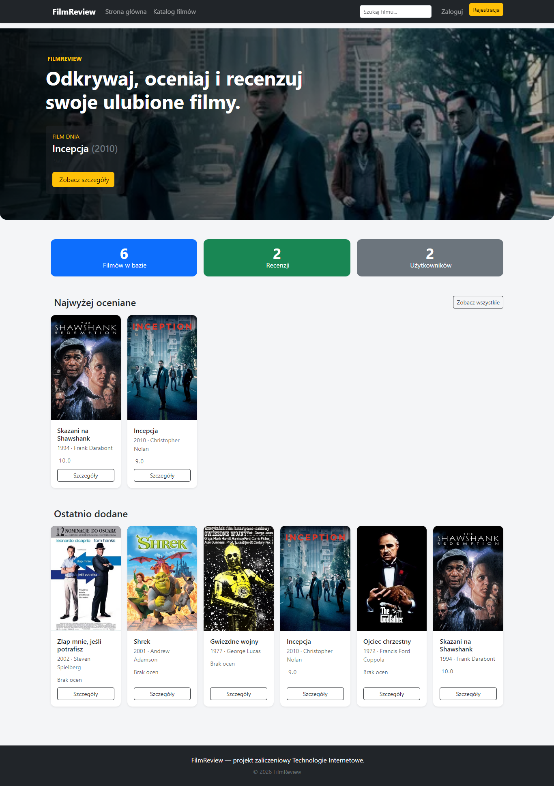

> **Górne menu (od lewej):** logo serwisu, „Strona główna", „Katalog filmów",
> pole **wyszukiwarki**, oraz po prawej przyciski **„Zaloguj"** i **„Rejestracja"**.

### 1.2. Katalog filmów
Kliknij **„Katalog filmów"** w górnym menu. Zobaczysz wszystkie filmy w postaci kafelków.
Po lewej stronie masz **filtry**:
- **Szybkie wyszukiwanie** — zacznij pisać tytuł, a podpowiedzi pojawią się od razu (bez przeładowania strony),
- **Gatunek** i **Rok** — wybierz z listy i kliknij **„Filtruj"**,
- na dole listy znajduje się **paginacja** (przełączanie stron), gdy filmów jest dużo.

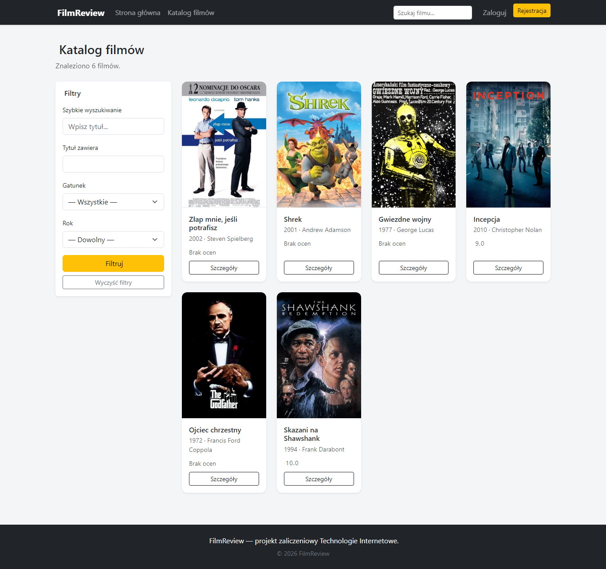

### 1.3. Szczegóły filmu
Kliknij dowolny film (kafelek lub przycisk **„Szczegóły"**). Otworzy się strona z plakatem,
opisem, reżyserem, gatunkami, średnią oceną oraz listą recenzji innych użytkowników.

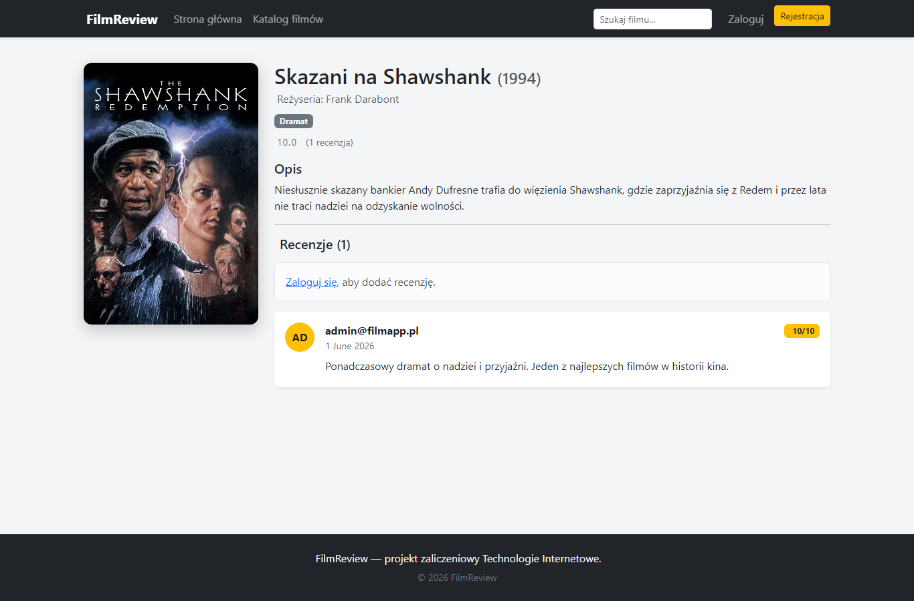

> Aby **dodać własną recenzję** lub **dodać film do watchlisty**, trzeba być zalogowanym
> (patrz Część 2 i 3).

---

## Część 2. Zakładanie konta i logowanie

### 2.1. Rejestracja (nowe konto)
1. W górnym menu kliknij **„Rejestracja"**.
2. Podaj **adres e-mail** i **hasło** (hasło wpisz dwa razy).
3. Kliknij **„Zarejestruj się"**.

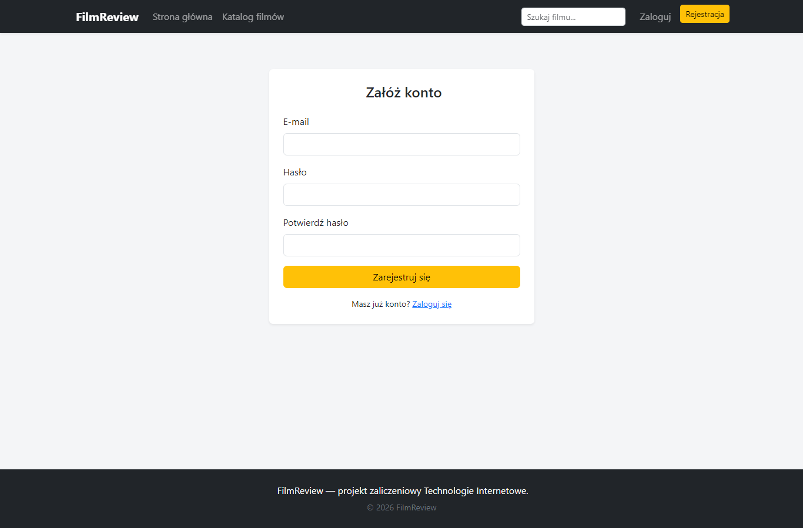

### 2.2. Logowanie
1. W górnym menu kliknij **„Zaloguj"**.
2. Wpisz e-mail i hasło, kliknij **„Zaloguj się"**.

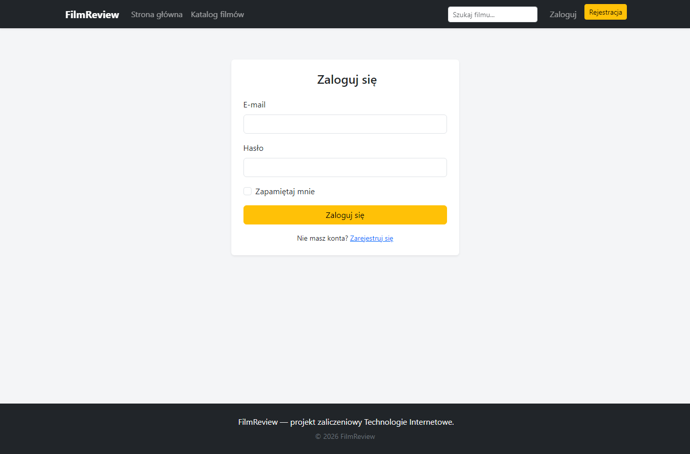

> Po zalogowaniu w prawym górnym rogu pojawi się Twój adres e-mail z rozwijanym menu
> (profil, watchlista, wylogowanie).

---

## Część 3. Funkcje zalogowanego użytkownika

### 3.1. Mój profil
Kliknij swój adres e-mail w prawym górnym rogu → **„Mój profil"**. Zobaczysz swój awatar
(inicjały), datę dołączenia, statystyki oraz ostatnie recenzje (które możesz edytować lub usunąć).

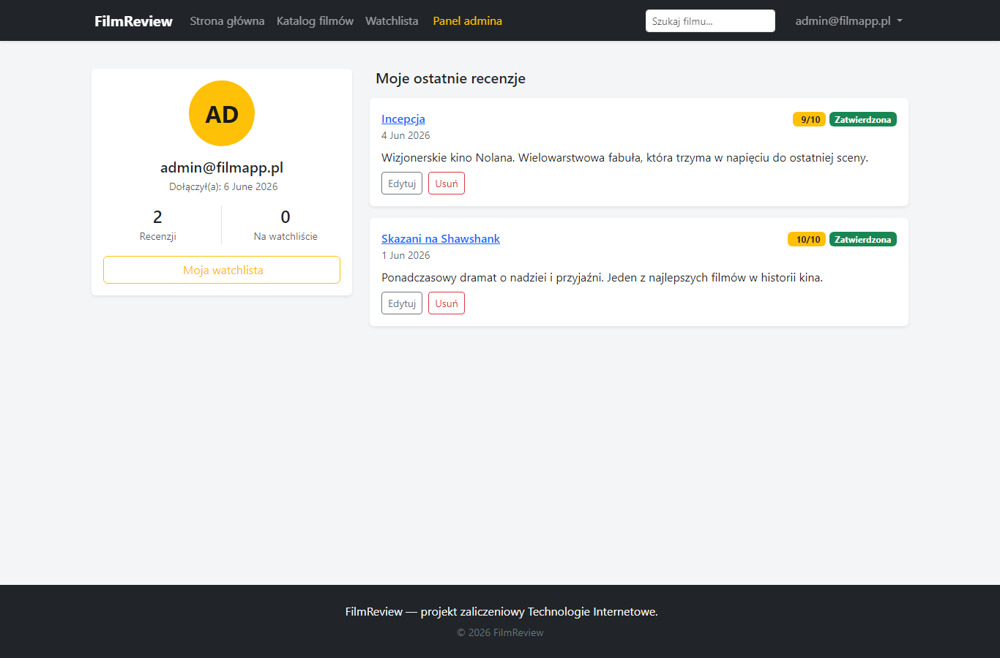

### 3.2. Watchlista („Chcę obejrzeć" / „Obejrzane")
Wejdź w **„Watchlista"** (górne menu lub menu pod e-mailem). Masz dwie zakładki:
- **Chcę obejrzeć** — filmy, które planujesz obejrzeć,
- **Obejrzane** — filmy już obejrzane.

Film dodajesz przyciskiem **„+"** (lub „Dodaj do watchlisty") na karcie/stronie filmu.
W watchliście możesz **zmienić status** (strzałki) lub **usunąć** film (kosz).

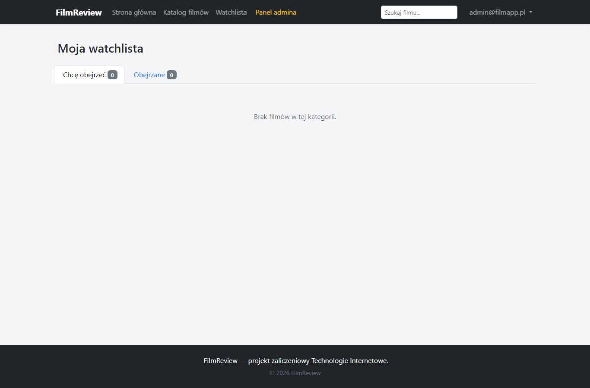

### 3.3. Dodawanie recenzji
Na stronie filmu (Część 1.3) wypełnij formularz **„Dodaj swoją recenzję"** (ocena 1–10 + treść)
i kliknij **„Wyślij recenzję"**. Recenzja trafi do **akceptacji administratora** i pojawi się
publicznie dopiero po zatwierdzeniu.

---

## Część 4. Logowanie do panelu administracyjnego

Panel administracyjny służy do zarządzania serwisem. Dostęp ma tylko konto z rolą **Administrator**.

**Dane logowania administratora (konto domyślne):**

| Pole | Wartość |
|---|---|
| E-mail | `admin@filmapp.pl` |
| Hasło | `Admin123!` |

Kroki:
1. Kliknij **„Zaloguj"** (górne menu).
2. Wpisz powyższy e-mail i hasło, kliknij **„Zaloguj się"**.
3. Po zalogowaniu w górnym menu pojawi się żółty przycisk **„Panel admina"** — kliknij go
   (albo wpisz adres `http://localhost:5081/Admin`).

> Jeśli zalogujesz się zwykłym kontem (bez uprawnień admina), próba wejścia do panelu
> wyświetli komunikat o braku dostępu — to normalne zabezpieczenie.

---

## Część 5. Panel administratora — przegląd

Panel ma **ciemne menu boczne** po lewej. Pierwszy ekran to **Dashboard** z licznikami
i listą ostatnich recenzji oczekujących na moderację.

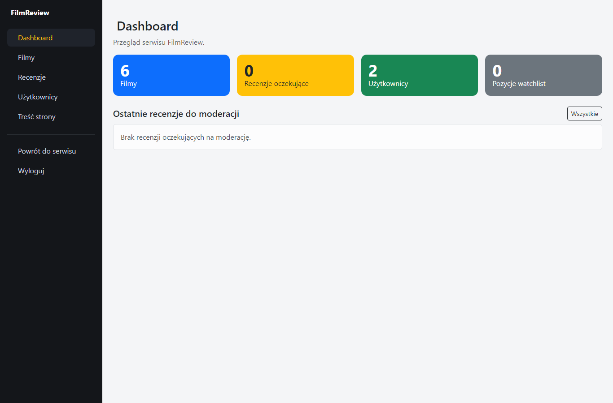

**Menu boczne (od góry):**
| Pozycja | Do czego służy |
|---|---|
| **Dashboard** | podsumowanie i statystyki |
| **Filmy** | dodawanie, edycja, usuwanie filmów |
| **Recenzje** | zatwierdzanie / odrzucanie recenzji |
| **Użytkownicy** | nadawanie ról i blokowanie kont |
| **Treść strony** | zmiana tekstów na stronie (CMS) |
| **Powrót do serwisu** | wyjście z panelu na stronę główną |
| **Wyloguj** | wylogowanie |

---

## Część 6. Customizacja treści strony

To najprostszy sposób na zmianę tekstów widocznych na stronie — **bez dotykania kodu**.

1. W menu bocznym panelu kliknij **„Treść strony"**.
2. Zobaczysz trzy pola do edycji:
   - **Tytuł serwisu** — nazwa widoczna w nagłówku i tytule strony,
   - **Opis w sekcji hero** — duży tekst na banerze strony głównej,
   - **Tekst stopki** — napis na dole każdej strony.
3. Zmień dowolne pole.
4. Kliknij zielony przycisk **„Zapisz zmiany"**.

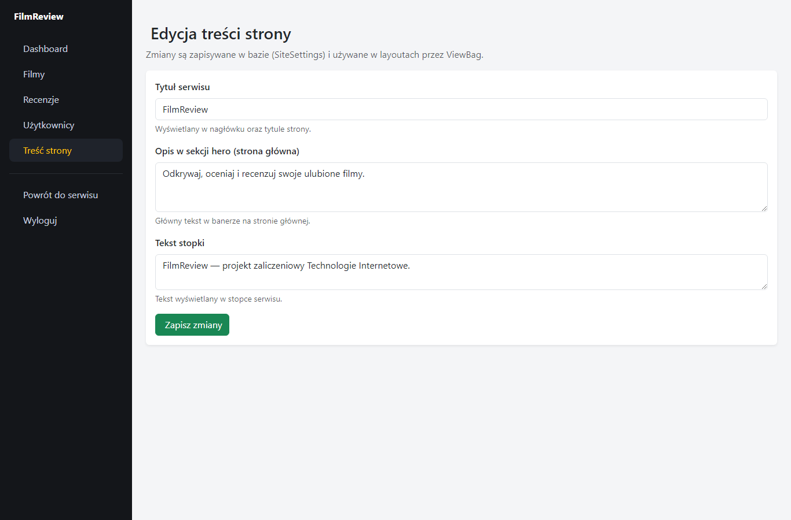

> **Efekt jest natychmiastowy.** Wróć na stronę główną (pozycja „Powrót do serwisu"),
> a zobaczysz nowy tytuł, opis na banerze i tekst w stopce.

**Przykład:** zmień „Tytuł serwisu" z `FilmReview` na `Moje Filmy` i zapisz — nazwa w lewym
górnym rogu zmieni się na całej stronie.

---

## Część 7. Dodawanie filmów

W menu bocznym kliknij **„Filmy"**, a następnie przycisk **„Dodaj film"**.
Masz dwie możliwości.

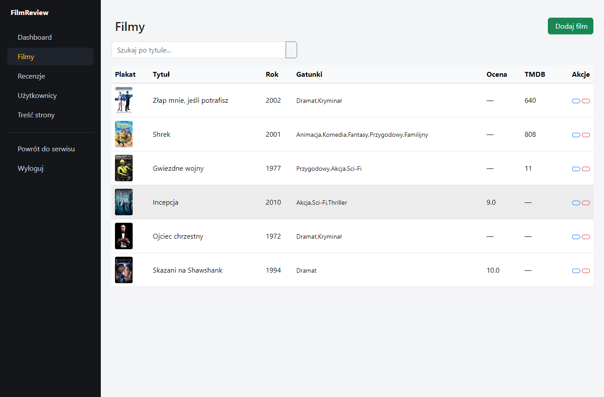

### Sposób A — Import z TMDB (najszybszy, automatyczny)
1. W sekcji **„Import z TMDB"** wpisz tytuł filmu (np. „Matrix").
2. Kliknij **„Szukaj w TMDB"**.
3. Pojawi się lista filmów z plakatami.
4. Przy wybranym filmie kliknij **„Importuj"** — dane i plakat zapiszą się automatycznie,
   a przycisk zmieni się na **„Zaimportowano"**.

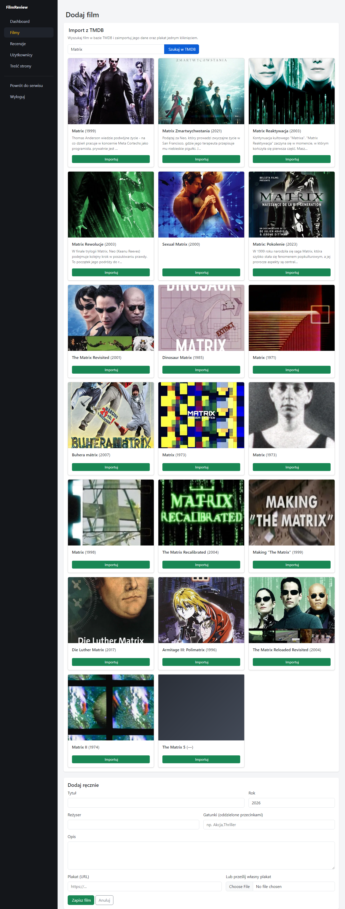

### Sposób B — Dodanie ręczne
Wypełnij formularz **„Dodaj ręcznie"** (tytuł, rok, reżyser, gatunki, opis).
Plakat możesz podać jako **adres URL** lub **wgrać plik z dysku**. Na końcu kliknij **„Zapisz film"**.

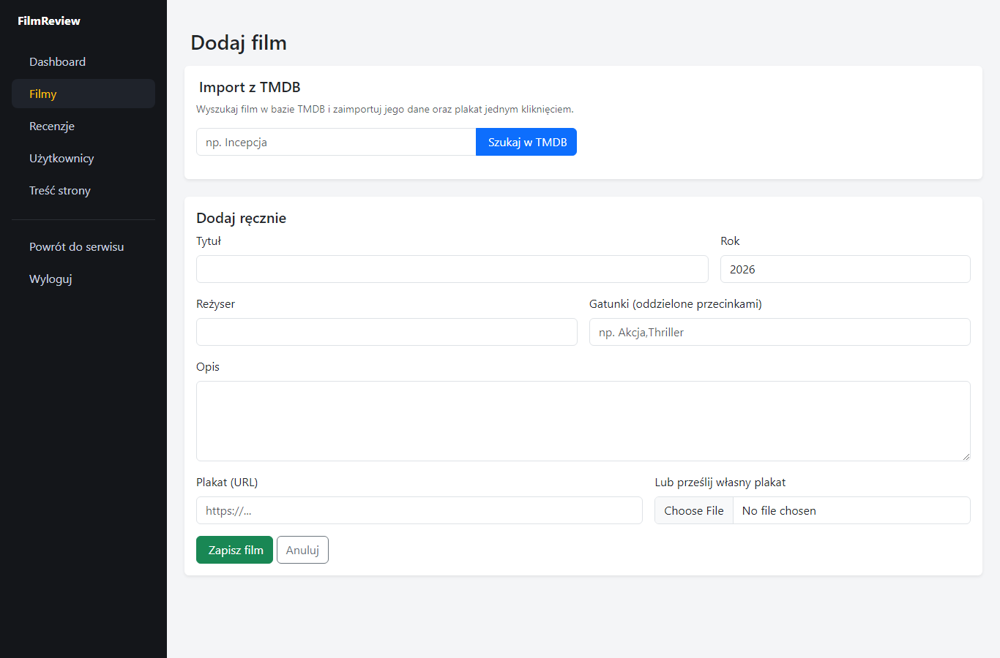

> Aby **edytować** lub **usunąć** istniejący film, użyj ikon ołówka / kosza w tabeli filmów.
> Przed usunięciem pojawi się okienko z prośbą o potwierdzenie.

---

## Część 8. Moderacja recenzji i użytkownicy

### 8.1. Zatwierdzanie recenzji
W menu bocznym kliknij **„Recenzje"**. Zobaczysz recenzje czekające na decyzję:
- **„Zatwierdź"** — recenzja stanie się widoczna publicznie,
- **„Odrzuć"** — recenzja zostanie usunięta.

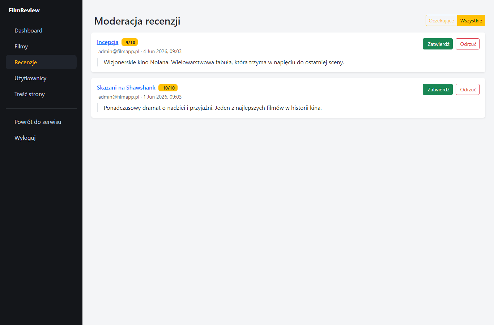

### 8.2. Zarządzanie użytkownikami
W menu bocznym kliknij **„Użytkownicy"**. Dla każdego konta możesz:
- **zmienić rolę** (zwykły użytkownik ↔ administrator),
- **zablokować / odblokować** konto.

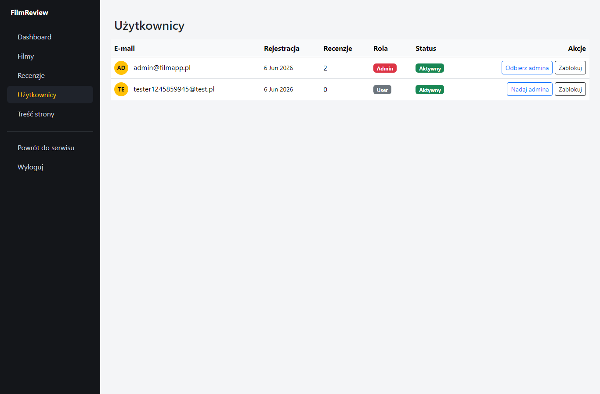

---

## Najczęstsze pytania

**Nie widzę przycisku „Panel admina".**
Zaloguj się kontem administratora (`admin@filmapp.pl`). Zwykłe konto nie ma dostępu do panelu.

**Dodałem recenzję, ale jej nie widać.**
Recenzje wymagają zatwierdzenia przez administratora (Część 8.1).

**Jak się wylogować?**
Kliknij swój e-mail w prawym górnym rogu → **„Wyloguj"** (lub w panelu admina pozycję „Wyloguj").

---

*Projekt zaliczeniowy — Technologie Internetowe, AGH.*
